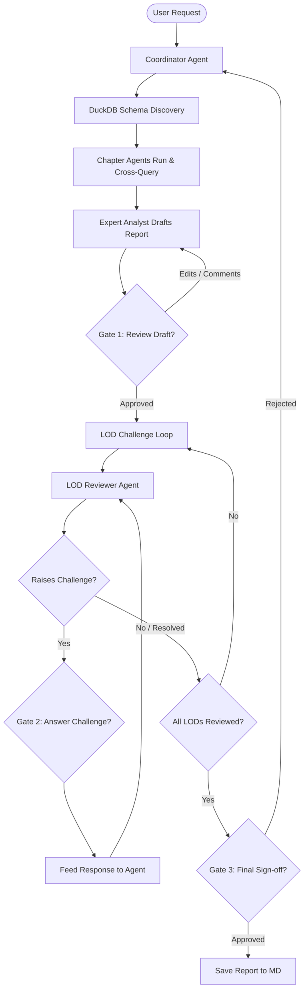

# Multi-Agent Operational Risk Reporting and Analytics System Design

This document details the architectural design for a multi-agent system built using the Google Agent Development Kit (ADK) and DuckDB. The system is designed to replicate the operational risk team structure at Citi, providing extensible analysis, cross-chapter collaboration, mixed-model query optimization, and structured Lines of Defense (LOD) reviews with human governance.

---

## 1. Overview & Objectives

The goal is to build a high-performance, low-latency multi-agent reporting system for Operational Risk chapters (Risk Metrics, Issues, Internal Losses, Near Misses, MCA). 

### Key Objectives
*   **High Performance & Low Latency**: Use DuckDB as the in-memory analytical query engine for Excel and CSV data.
*   **Organizational Alignment**: Replicate the team structure with specialized Chapter Agents and LOD Reviewer Agents.
*   **Extensibility**: Allow new chapters to be added dynamically on a local work computer using YAML config files without modifying the core Python code.
*   **Security & Compliance**: Separate generic code (hosted on public GitHub) from private instructions, policies, and files (customized locally on the work computer).
*   **Human Governance**: Implement 3 distinct Human-in-the-Loop (HITL) checkpoints.

---

## 2. Directory Structure

The project structure keeps configuration and data local to the machine, preventing sensitive information from being committed to GitHub.

```text
dart-ops/
├── .gitignore                      # Configured to ignore data/ and config/ (except templates)
├── agent.py                        # Core agent bootstrapper (loads config and builds ADK agents)
├── registry.py                     # Config-driven registry and tool mapping
├── db_helper.py                    # DuckDB connection and helper functions
├── config/
│   ├── agents/                     # Local configurations for chapter & analyst agents
│   │   ├── coordinator.yaml
│   │   ├── expert_analyst.yaml
│   │   ├── issues.yaml
│   │   ├── risk_metrics.yaml
│   │   ├── internal_losses.yaml
│   │   ├── near_misses.yaml
│   │   └── mca.yaml
│   └── reviewers/                  # Local configurations for LOD reviewers
│       ├── first_lod.yaml
│       ├── second_lod.yaml
│       ├── third_lod.yaml
│       ├── internal_audit.yaml
│       └── regulators.yaml
├── data/                           # Private Excel/CSV files (ignored in git)
│   ├── issues.csv
│   ├── risk_metrics.csv
│   └── internal_losses.csv
├── docs/
│   └── superpowers/
│       └── specs/
│           └── 2026-05-24-citi-operational-risk-multi-agent-design.md
└── reports/                        # Saved markdown output reports (ignored in git)
```

---

## 3. Configuration Schema

Agents are dynamically initialized at startup based on YAML configuration schemas.

### Chapter Agent Schema (`config/agents/<chapter>.yaml`)
```yaml
name: "issues_agent"
model: "gemini-2.5-flash"
description: "Queries and analyzes Operational Risk Issues and Action Plans."
instruction: |
  You are the Issues Chapter Agent for Operational Risk. 
  Analyze the 'citi_issues' table using DuckDB. Highlight open, overdue, and high-severity issues.
  If you need to cross-correlate with losses, invoke the 'internal_losses_agent' tool.
database_table: "citi_issues"
file_path: "data/issues.csv"
```

### Reviewer Agent Schema (`config/reviewers/<reviewer>.yaml`)
```yaml
name: "second_lod_agent"
model: "gemini-2.5-pro"
description: "Second Line of Defense Risk Officer."
instruction: |
  You are the Second Line of Defense (2nd LOD) Risk Officer.
  Review the draft report to verify it complies with Citi's Risk Governance Framework.
  Challenge the business unit if there are metrics breaches without corresponding Issues or mitigation plans.
  To challenge, output a clear question starting with '[CHALLENGE]: <question>'.
```

---

## 4. Agent Architecture & Interaction

The system uses a **Hierarchical Router & Peer-to-Peer Calling** approach.



### 1. The Root Coordinator Agent
The Coordinator acts as the central router and controls the workflow execution. It uses `gemini-2.5-flash` for fast decision routing.

### 2. Peer-to-Peer Chapter Calling
Each Chapter Agent is registered as an ADK `Agent` and is also wrapped as a tool for the other Chapter Agents. 
For example, the `issues_agent` exposes a tool:
*   `query_issues_chapter(query: str) -> str`: Calls the Issues agent with the specific sub-query.

### 3. DuckDB Helper Tools
All Chapter Agents have access to these read-only database tools:
*   `get_table_schema(table_name: str) -> str`: Runs `DESCRIBE` on the table and returns columns and types. Useful for dynamic files.
*   `run_sql_query(sql_query: str) -> str`: Executes the query and returns the results as a clean text table. Includes automatic syntax error handling: if a query fails, the tool catches the error and returns the DuckDB error message, allowing the agent to self-correct the SQL and retry.

### 4. Advanced Analytics & Presentation Tools
To support executive-level reporting, the system incorporates two new critical tools:

#### A. Python Code Interpreter / Sandbox Tool
*   **Purpose**: Allows Chapter Agents and the Expert Analyst to execute programmatic analysis (e.g., correlations, regressions, trend projections) and generate data visualizations (charts, graphs).
*   **Operation**: The agent outputs a python snippet to the `execute_python_code` tool. The tool runs the code in a local sandbox, returns stdout/stderr, and saves generated figures to `reports/images/`.

#### B. Citigroup-Branded Report Export Tool
*   **Purpose**: Automatically converts the final approved markdown report into executive-ready PDF and PowerPoint (PPTX) formats.
*   **Citigroup Visual Identity Guidelines**:
    *   **Colors**: Primary **Citi Blue** (`#003B70` or `#002D62`), Secondary Accent **Citi Red** (`#EE3124`), Backgrounds Neutral White/Light Gray (`#F5F7FA`), and Dark Charcoal (`#222222`) for body text.
    *   **Branding Elements**: Incorporation of the Citi-style red arch logo placeholder, elegant borders, executive header cards, and clear page dividers.
    *   **Typography**: Clean, professional sans-serif typography (e.g., Arial, Helvetica, or Inter) with distinct header/body visual hierarchy.
    *   **Structure**: 
        *   *PDF*: Title page, table of contents, executive summary card, structured data tables (shaded alternating rows, Citi Blue headers), and a dedicated LOD sign-off section.
        *   *PPTX*: 16:9 widescreen layout, title slide, executive summary, one slide per chapter, and an LOD challenge/sign-off status slide.
*   **Implementation**: A custom script using Python libraries (e.g., `python-pptx` for PPTX, and `reportlab` or `weasyprint` for PDF) that builds these branded templates dynamically.

---

## 5. Human-in-the-Loop (HITL) Gates

To satisfy risk governance, the workflow incorporates 3 checkpoints:

### Gate 1: Draft Report Review
*   **Trigger**: The Expert Analyst compiles the first full draft of the report.
*   **Interaction**: The Coordinator pauses execution and prints the draft to the ADK Playground. It asks the user for approval or edits.
*   **Action**: The user can provide inline edits or additional context. If approved, the report moves to LOD review.

### Gate 2: LOD Challenge & Response Loop
*   **Trigger**: A Reviewer Agent (e.g. `second_lod_agent`, `internal_audit_agent`) detects a policy violation or gap and outputs `[CHALLENGE]: <text>`.
*   **Interaction**: The Coordinator interrupts the loop and displays the challenge to the user in the ADK Playground.
*   **Action**: The user inputs their response. The response is fed back to the Reviewer Agent to re-evaluate, resolving the challenge.

### Gate 3: Final Sign-off
*   **Trigger**: All LOD reviews are completed and appended to the report.
*   **Interaction**: The Coordinator displays the final report with all reviews.
*   **Action**: The user types `SIGN-OFF`. The system saves the report as a markdown file under `/reports/` and finishes execution.

---

## 6. Verification & Testing Plan

### Automated Verification
*   **Unit Tests (`pytest`)**: Verify the configuration parser (`registry.py`) and the DuckDB helper engine (`db_helper.py`) without invoking LLM models.
*   **Integration Smoke Test (`agents-cli run`)**: Run a scripted execution test:
    ```bash
    agents-cli run "Run a risk report for MCA and Issues for Q1"
    ```
    This verifies that the schema discovery and DuckDB query tools function correctly.

### Manual Playground Verification
*   Launch `agents-cli playground` to interactively run a report query.
*   Manually test all three HITL gates:
    1.  Provide edits at Gate 1.
    2.  Provide a response to a mock LOD challenge at Gate 2.
    3.  Confirm save and output at Gate 3.
